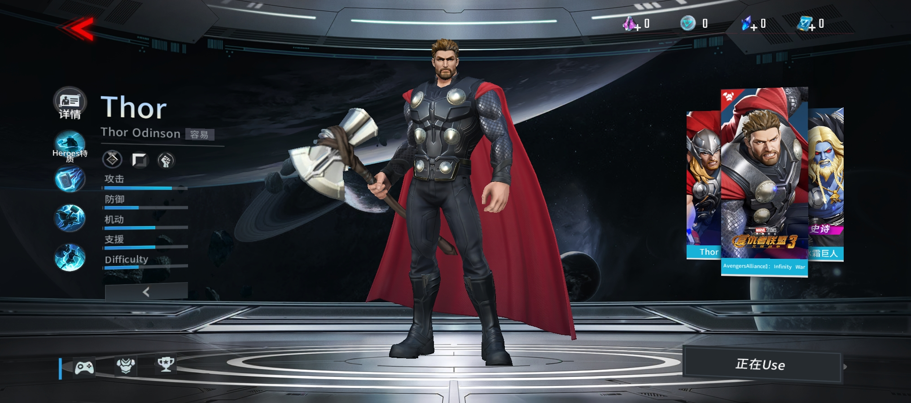
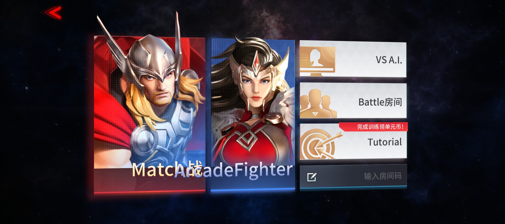
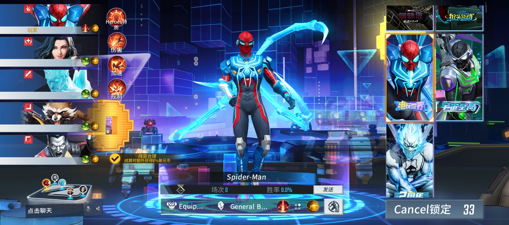
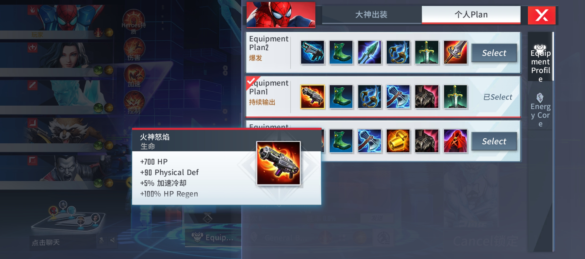
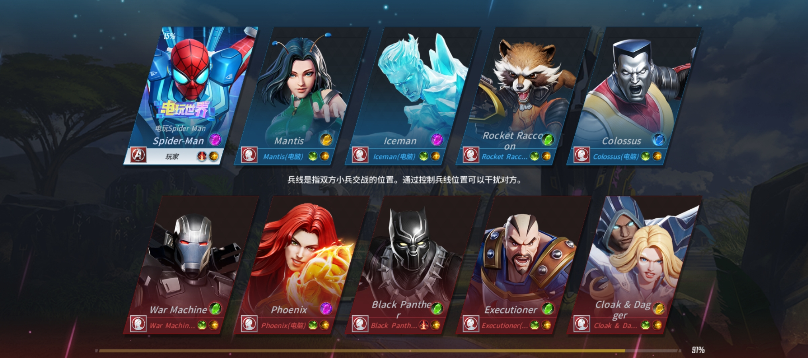

# Screenshots — English Localization Mod

All screenshots taken in-game after applying `reborn_offline.py`.

---

### 1. Hero Profile — Thor
> Hero name, subtitle "Thor Odinson", and stat labels partially translated.

---

### 2. Game Mode Select
> VS A.I. and Tutorial buttons translated. "Match" and "MatchArcadeFighter" visible.

---

### 3. Hero Select — Spider-Man
> "Spider-Man" hero name, "Equip...", "General B..." (General Burst) tabs at bottom, "Cancel" button.

---

### 4. Equipment Plan Panel
> "Equipment Plan1/2", "Select", "Equipment Profile", "Energy Core" sidebar labels. Item stats show "+700 HP", "+90 Physical Def", "+100% HP Regen".

---

### 5. Match Loading — Hero Cards
> Hero names fully translated: Spider-Man, Mantis, Iceman, Rocket Raccoon, Colossus, War Machine, Phoenix, Black Panther, Executioner, Cloak & Dagger.

*Mod: [`reborn_offline.py`](../../assets/Documents/reborn_offline.py) · Install: [English](../../INSTALL_EN.md) | [Bahasa Indonesia](../../INSTALL_ID.md)*
